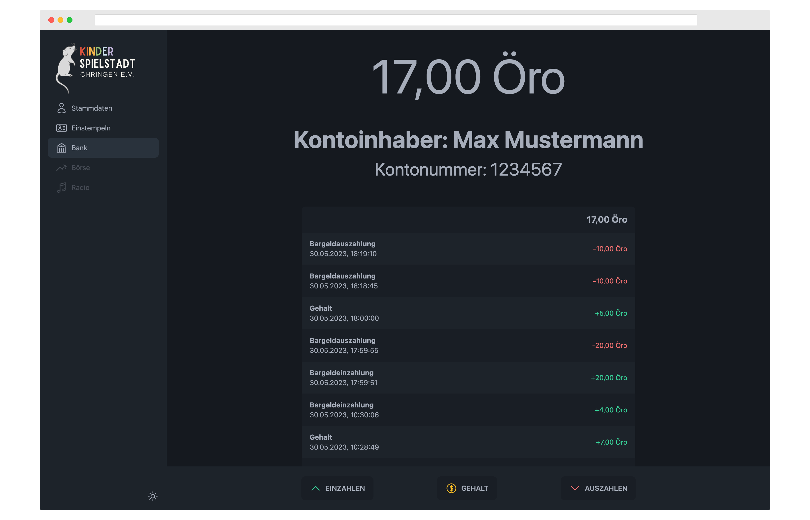

<h1 align="center">🔥 Core - Kinderspielstadt Öhringen 🔥</h1>
<h3 align="center">Personal data administration, user check in and a banking system</h1>
<p align="center">

</p>

This is our repository containing all required resources to run the "Core" WebApp from the "Kinderspielstadt Öhringen".  
This repository also contains all the required Pocketbase files to run the backend server.

## 🚀 Getting Started

The following instructions will get you a copy of the project up and running on your local machine for development and testing purposes.  
See deployment for notes on how to deploy the project on a live system.

### 🍽️ Prerequisites

`NodeJS (including PNPM)` is required to run this project.  
Also `Go` is required to run the built in server.

### 📦 Installing

At first clone this repository to your local machine by using

```
git clone https://git.cliffbreak.de/Kispi/Core.git
```

Change to the cloned repository

```
cd Core
```

Copy the example environment file

```
cp .env.example .env

```

To install all required webapp packages run

```
cd webapp && pnpm install
```

To start the webapp in development mode run the following npm script

```
pnpm dev
```

To build the webapp run the following npm script

```
pnpm build
```

To install all required server packages run

```
cd ../server && go mod download
```

To generate unique VAPID keys run the following Go command copy this keys to the `.env` file

```
go run main.go generate-vapid-keys
```

To start the server run the following Go command

```
go run main.go serve
```

If you do changes to the database schema keep in mind to `Export collections` via the Pocketbase UI.
Paste the exported JSON into the `pb_schema.json` file and run the following npm script to update the frontend schema types.

```
cd ../webapp && pnpm typegen
```

## 🧑‍💻 Configure Visual Studio Code
If you haven't a instance of Visual Studio Code up and running download the latest version [here](https://code.visualstudio.com/download).  
Install the recommended extensions by opening the Extensions-Tab (Ctrl+Shift+X).  
Enter `@recommended` and install all extensions.  
After that restart Visual Studio Code to apply all changes.

## 🎉 Contributing
Please refer to our **[COMMIT_CONVENTION](COMMIT_CONVENTION.md)**

## 🏗️ Built With

* [Node.js](https://nodejs.org/) - The JavaScript runtime used as the projects base
* [PNPM](https://pnpm.io/) - Faster alternative to npm for managing dependencies
* [Vue.js](https://vuejs.org/) - The Frontend Web Framework
* [Vite](https://vitejs.dev/) - Used Frontend Tooling
* [Go](https://go.dev/) - The Backend Programming Language
* [Pocketbase](https://pocketbase.io/) - The Backend Framework


## 🤵 Authors

* **Simon Giesel** - *Project Lead & Initial work* - [Simon Giesel](https://git.cliffbreak.de/SimGie)