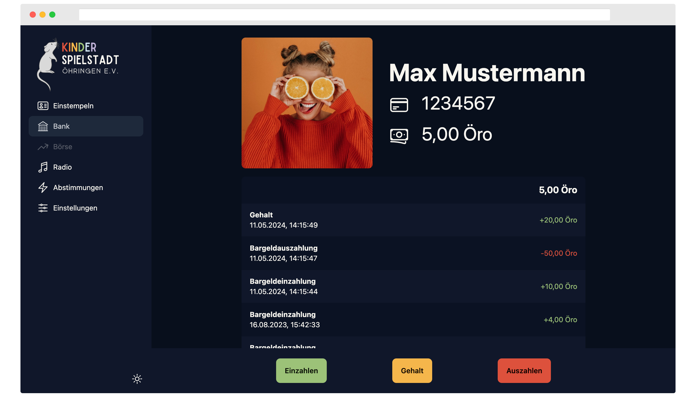

<h1 align="center">🔥 Core - Kinderspielstadt Öhringen 🔥</h1>
<h3 align="center">Verwaltung + Bank + Radio = ❤️</h1>
<p align="center">

</p>

This is our repository containing all required resources to run the "Core" WebApp from the "Kinderspielstadt Öhringen".  
This repository also contains all the required Appwrite cloud functions if any exist.

## 🚀 Getting Started

The following instructions will get you a copy of the project up and running on your local machine for development and testing purposes.  
See deployment for notes on how to deploy the project on a live system.

### 🍽️ Prerequisites

`NodeJS (including PNPM)` is required to run this project.  
Also a hosted instance of `Appwrite` is required.  

### 📦 Installing

At first clone this repository to your local machine by using

```
git clone https://git.cliffbreak.de/Kontast/Core.git
```

Change to the cloned repository

```
cd Core
```

To install all required packages run

```
pnpm install
```

To start the webapp in development mode run the following npm script

```
pnpm run dev
```

## 🧑‍💻 Configure Visual Studio Code
If you haven't a instance of Visual Studio Code up and running download the latest version [here](https://code.visualstudio.com/download).  
Install the recommended extensions by opening the Extensions-Tab (Ctrl+Shift+X).  
Enter `@recommended` and install all extensions.  
After that restart Visual Studio Code to apply all changes.

## 🎉 Contributing
Please refer to our **[COMMIT_CONVENTION](COMMIT_CONVENTION.md)**

## 🏗️ Built With

* [Node.js](https://nodejs.org/) - The JavaScript runtime used as the projects base
* [PNPM](https://pnpm.io/) - Faster alternative to npm for managing dependencies
* [Vue.js](https://vuejs.org/) - The Frontend Web Framework
* [Vite](https://vitejs.dev/) - Used Frontend Tooling
* [Appwrite](https://docs.mongodb.com/) - The hosted Backend used for this application

## 🤵 Authors

* **Simon Giesel** - *Project Lead & Initial work* - [Simon Giesel](https://git.cliffbreak.de/SimGie)